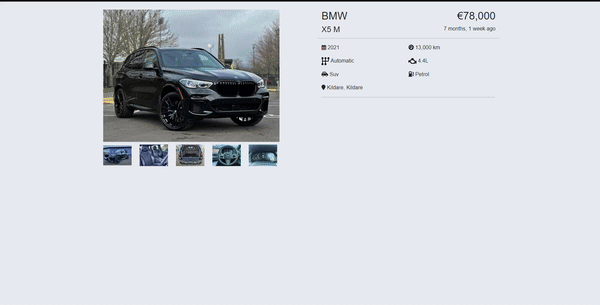

# Mastering Image Galleries with Lightbox2


Have you ever been in a situation where you wanted to display your product images or gallery in a more friendly and interactive way? A quick Google search should help you find a solution! And then you come across tons of tutorials on how to build the functionality from scratch using JavaScript and you think surely there must be an easier way! You've come to the right place.

In this article, we are going to explore the power of Lightbox2 which allows us to render images in a more user-friendly way with just a few lines of code

#### Installation
There are two options to install Lightbox2. 

1. Install using npm 
```
npm install lightbox2 --save
```

2. Download the zip of the latest release from [Lightbox2's GitHub releases page](https://github.com/lokesh/lightbox2/releases) and copy it into your project folder

#### Setting up
First, we need to link the `lightbox.css` and `lightbox.js` files in our HTML file
- Include the CSS at the top of your page in your `<head>` tag. Ensure you use the correct path to the `lightbox.css` file such as `src/css/lightbox.css` folder.

```
<link href="path/to/lightbox.css" rel="stylesheet" />
```

- Include the Javascript at the bottom of your page before the closing `</body>` tag. Please note that jQuery is required. If you are already using it, make sure it is loaded before Lighbox2. If you are not currently using jQuery include `dist/js/lightbox-plus-jquery.js`

```
<script src="path/to/lightbox.js"></script>
```

#### Rendering Images
- Single Images. Add a data-lightbox attribute to any image link to enable Lightbox. For the value of the attribute, use a unique name for each image. For example:

```
<a href="images/image-1.jpg" data-lightbox="image-1" data-title="My caption">Image #1</a>
```

- Image Sets. If you have a group of related images that you would like to combine into a set, use the same data-lightbox attribute value for all of the images. For example:

```
<a href="images/image-2.jpg" data-lightbox="roadtrip">Image #2</a>
<a href="images/image-3.jpg" data-lightbox="roadtrip">Image #3</a>
<a href="images/image-4.jpg" data-lightbox="roadtrip">Image #4</a>
```
#### Building a gallery
Now, let's build a simple gallery to showcase Lightbox2's capabilities. For this example, we will be using Bootstrap 5 and Fontawesome.
We will render each image, wrapped in an anchor tag, which will act as a link to the preview. It is as simple as that and we have our user-friendly and responsive gallery.

```
<div class="col-12 col-lg-6">
    <!-- Images carousel -->
    <a href="./media/bmw-x5-m60i-main.webp" data-lightbox="listing-images">
        
    </a>
    <div class="row mb-5 thumbs mt-2">
        <div class="col-4 col-md-2 mt-2 mt-md-0">
            <a href="./media/bmw-x5M-2.webp" data-lightbox="listing-images">
                
            </a>
        </div>

        <div class="col-4 col-md-2 mt-2 mt-md-0">
            <a href="./media/bmw-x5M-3.webp" data-lightbox="listing-images">
                
            </a>
        </div>

        <div class="col-4 col-md-2 mt-2 mt-md-0">
            <a href="./media/bmw-x5M-4.webp" data-lightbox="listing-images">
                
            </a>
        </div>

        <div class="col-4 col-md-2 mt-2 mt-md-0">
            <a href="./media/bmw-x5M-5.webp" data-lightbox="listing-images">
                
            </a>
        </div>

        <div class="col-4 col-md-2 mt-2 mt-md-0">
            <a href="./media/bmw-x5M-6.webp" data-lightbox="listing-images">
                
            </a>
        </div>
    </div>
</div>
```



You can find out more about Lightbox2 [here](https://lokeshdhakar.com/projects/lightbox2/#getting-started)
To view the source code for this tutorial click [here](https://github.com/Dayana-N/lightbox2-article)
If you found this article helpful, please share it with your friends.